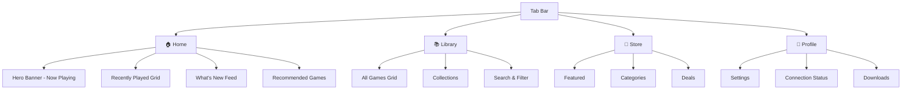

# 🎮 GameNativeiOS — Mobile UI Design Guide
### *Inspired by SteamOS Big Picture Mode*

---

> [!NOTE]
> This guide translates the core design philosophy of SteamOS Big Picture Mode into a native iOS mobile experience. The goal is to create a **premium, console-like game launcher** that feels at home on an iPhone or iPad — dark, immersive, and touch-first.

---

## 1. Design Philosophy

SteamOS Big Picture Mode succeeds because of three pillars:

| Pillar | SteamOS Approach | Mobile Adaptation |
|---|---|---|
| **Immersion** | Full-screen dark UI, bold game art fills the viewport | Edge-to-edge dark canvas, game artwork as hero elements |
| **Simplicity** | Controller-first — minimal buttons, clear focus states | Touch-first — large tap targets, swipe gestures, haptic feedback |
| **Speed** | Quick Access Menu overlay for instant navigation | Bottom tab bar + swipe-up Quick Actions panel |

**Key principle:** *The games are the UI.* Cover art, screenshots, and media should dominate — chrome and menus should recede.

---

## 2. Color Palette

The color system is built on a deep, cool dark theme with warm accent highlights — directly inspired by Steam's signature palette.

### Core Colors

| Token | Hex | Usage |
|---|---|---|
| `--bg-primary` | `#1B2838` | Main background (deep navy) |
| `--bg-secondary` | `#2A475E` | Cards, elevated surfaces |
| `--bg-tertiary` | `#171A21` | Deepest background, overlays |
| `--bg-surface` | `#16202D` | Side panels, modals |

### Accent Colors

| Token | Hex | Usage |
|---|---|---|
| `--accent-gold` | `#D19345` | Primary CTA buttons, active states, badges |
| `--accent-blue` | `#194C84` | Selected items, links, focus rings |
| `--accent-cyan` | `#99DCE9` | Notifications, live status indicators |
| `--accent-green` | `#4CAF50` | Online/success states |

### Text Colors

| Token | Hex | Usage |
|---|---|---|
| `--text-primary` | `#FFFFFF` | Headings, game titles |
| `--text-secondary` | `#B8BCBF` | Descriptions, metadata |
| `--text-muted` | `#67707B` | Timestamps, tertiary info |

### Gradients

```
Hero Fade:      linear-gradient(to bottom, transparent, #1B2838)
Card Glow:      radial-gradient(ellipse at center, rgba(209,147,69,0.15), transparent)
Tab Indicator:  linear-gradient(90deg, #D19345, #99DCE9)
```

---

## 3. Typography

| Role | Font | Size (pt) | Weight |
|---|---|---|---|
| **Screen Title** | SF Pro Display | 28 | Bold |
| **Section Header** | SF Pro Display | 20 | Semibold |
| **Game Title** | SF Pro Text | 16 | Semibold |
| **Body** | SF Pro Text | 14 | Regular |
| **Caption** | SF Pro Text | 12 | Regular |
| **Badge/Tag** | SF Pro Text | 10 | Medium |

> [!TIP]
> Use SF Pro (system font) for native iOS feel. For a more "gaming" personality, consider supplementing headers with **Inter** or **Outfit** from Google Fonts.

---

## 4. Spacing & Grid System

### Spacing Scale

| Token | Value |
|---|---|
| `--space-xs` | 4pt |
| `--space-sm` | 8pt |
| `--space-md` | 16pt |
| `--space-lg` | 24pt |
| `--space-xl` | 32pt |
| `--space-2xl` | 48pt |

### Grid Layout

- **Game tiles:** 2-column grid on iPhone, 3–4 columns on iPad
- **Gutter:** 12pt between tiles
- **Edge padding:** 16pt (iPhone), 24pt (iPad)
- **Card border-radius:** 10pt (matches SteamOS rounded corners)

---

## 5. App Structure & Navigation

### Information Architecture



### Bottom Tab Bar

The primary navigation uses a **fixed bottom tab bar** (iOS-native pattern), adapting Big Picture's sidebar categories:

| Tab | Icon | Label | Corresponds to BPM |
|---|---|---|---|
| Home | `house.fill` | Home | BPM Home Screen |
| Library | `gamecontroller.fill` | Library | BPM Library / All Games |
| Store | `bag.fill` | Store | BPM Store |
| Profile | `person.fill` | Me | BPM Account / Settings |

**Styling:**
- Background: `#171A21` with blur (UIBlurEffect)
- Active tab: `--accent-gold` icon + label
- Inactive tab: `--text-muted` icon + label
- Tab indicator: 3pt rounded pill above active icon using `--accent-gold`

### Quick Actions Panel (← replaces BPM's Guide Button Overlay)

Swipe up from bottom edge or long-press the active tab to reveal:
- 🔍 Universal Search
- 📥 Downloads queue
- 👥 Friends & online status
- ⚙️ Quick Settings (brightness, audio, connection)

---

## 6. Screen-by-Screen Breakdown

### 6.1 — Home Screen

The emotional center of the app. Mirrors BPM's "big bold game covers" philosophy.

```
┌─────────────────────────────────┐
│  ● Status Bar                   │
├─────────────────────────────────┤
│                                 │
│  ┌─────────────────────────────┐│
│  │                             ││
│  │     HERO BANNER             ││
│  │     Now Playing / Last Game ││
│  │     ▶ Continue Playing      ││
│  │                             ││
│  └─────────────────────────────┘│
│                                 │
│  Recently Played          See All│
│  ┌──────┐ ┌──────┐ ┌──────┐   │
│  │      │ │      │ │      │ → │
│  │ Game │ │ Game │ │ Game │   │
│  │  1   │ │  2   │ │  3   │   │
│  └──────┘ └──────┘ └──────┘   │
│                                 │
│  What's New                     │
│  ┌─────────────────────────────┐│
│  │ 🔴 Event Card              ││
│  │ "Season 4 starts now"      ││
│  └─────────────────────────────┘│
│                                 │
│  Recommended For You            │
│  ┌──────┐ ┌──────┐ ┌──────┐   │
│  │      │ │      │ │      │ → │
│  │      │ │      │ │      │   │
│  └──────┘ └──────┘ └──────┘   │
│                                 │
├─────────────────────────────────┤
│  🏠    📚    🛒    👤          │
└─────────────────────────────────┘
```

**Key elements:**
- **Hero Banner** — Full-bleed game artwork for the most recently played game with a gradient overlay (`Hero Fade`) and a "Continue Playing" CTA button in `--accent-gold`
- **Recently Played** — Horizontal scroll of portrait game tiles (3:4 ratio), matching BPM's tile layout
- **What's New** — Event cards with countdown timers and live badges (`--accent-cyan`)
- **Recommended** — Algorithm-driven horizontal rail

### 6.2 — Library Screen

Mirrors BPM's "All Games" and "Collections" sidebar categories.

```
┌─────────────────────────────────┐
│  Library              🔍  ≡    │
├─────────────────────────────────┤
│  [All] [Installed] [Collections]│
├─────────────────────────────────┤
│                                 │
│  ┌──────┐ ┌──────┐             │
│  │      │ │      │             │
│  │ Game │ │ Game │             │
│  │  A   │ │  B   │             │
│  │      │ │      │             │
│  └──────┘ └──────┘             │
│  ┌──────┐ ┌──────┐             │
│  │      │ │      │             │
│  │ Game │ │ Game │             │
│  │  C   │ │  D   │             │
│  │      │ │      │             │
│  └──────┘ └──────┘             │
│  ┌──────┐ ┌──────┐             │
│  │      │ │      │             │
│  │ Game │ │ Game │             │
│  │  E   │ │  F   │             │
│  └──────┘ └──────┘             │
│                                 │
├─────────────────────────────────┤
│  🏠    📚    🛒    👤          │
└─────────────────────────────────┘
```

**Key elements:**
- **Segmented control** at top: All / Installed / Collections (pill-style tabs)
- **2-column portrait grid** of game cover art (vertical covers, matching BPM's portrait art style)
- **Sort/Filter** button (≡) opens a bottom sheet with: Sort by Name/Recent/Size, Filter by genre/platform
- **Search** is inline — tapping 🔍 reveals a search bar with instant results (BPM's universal search)
- **Pull-to-refresh** to sync library from PC

### 6.3 — Game Detail Screen

Entered by tapping any game tile. Mirrors BPM's game page with tabs.

```
┌─────────────────────────────────┐
│  ← Back                   ⋮    │
├─────────────────────────────────┤
│                                 │
│  ┌─────────────────────────────┐│
│  │                             ││
│  │     HERO ART / SCREENSHOT  ││
│  │     (parallax on scroll)   ││
│  │                             ││
│  └─────────────────────────────┘│
│                                 │
│   GAME TITLE                    │
│   Developer • Genre • 45 GB    │
│                                 │
│  ┌─────────────────────────────┐│
│  │    ▶  PLAY / STREAM         ││
│  └─────────────────────────────┘│
│                                 │
│  [Overview] [Media] [Your Stuff]│
│                                 │
│  Overview content...            │
│  - Description                  │
│  - Compatibility badge          │
│  - System requirements          │
│                                 │
│  Media content...               │
│  - Screenshots carousel         │
│  - Trailers                     │
│                                 │
│  Your Stuff content...          │
│  - Achievements (12/50)         │
│  - DLC                          │
│  - Play time: 48h               │
│                                 │
├─────────────────────────────────┤
│  🏠    📚    🛒    👤          │
└─────────────────────────────────┘
```

**Key elements:**
- **Hero parallax** — Game artwork scrolls at 0.5× speed for depth effect (premium feel)
- **Primary CTA** — Full-width "Play" or "Stream" button in `--accent-gold`
- **Tabbed content** — Three tabs mirroring BPM's game page tabs: Overview, Media, Your Stuff
- **Compatibility badge** — Green/Yellow/Red shield icon (like Steam Deck Verified badges)
- **Achievement progress** — Circular progress ring with `--accent-cyan` fill

### 6.4 — Store Screen

```
┌─────────────────────────────────┐
│  Store                 🔍      │
├─────────────────────────────────┤
│                                 │
│  ┌─────────────────────────────┐│
│  │   FEATURED SALE BANNER      ││
│  │   (auto-rotating carousel)  ││
│  └─────────────────────────────┘│
│                                 │
│  Top Sellers                    │
│  ┌──────┐ ┌──────┐ ┌──────┐   │
│  │      │ │      │ │      │ → │
│  └──────┘ └──────┘ └──────┘   │
│                                 │
│  Categories                     │
│  ┌────────┐ ┌────────┐        │
│  │ Action │ │  RPG   │        │
│  └────────┘ └────────┘        │
│  ┌────────┐ ┌────────┐        │
│  │Strategy│ │ Indie  │        │
│  └────────┘ └────────┘        │
│                                 │
│  Deals & Specials        See All│
│  ┌─────┐ ┌─────┐ ┌─────┐     │
│  │-40% │ │-60% │ │-25% │  →  │
│  └─────┘ └─────┘ └─────┘     │
│                                 │
├─────────────────────────────────┤
│  🏠    📚    🛒    👤          │
└─────────────────────────────────┘
```

### 6.5 — Profile / Settings Screen

```
┌─────────────────────────────────┐
│  Profile                        │
├─────────────────────────────────┤
│                                 │
│      ┌──────────┐              │
│      │  Avatar  │              │
│      └──────────┘              │
│      Username                   │
│      ● Online                   │
│                                 │
│  ┌─────────────────────────────┐│
│  │ 🖥  Connection       ●PC   ││
│  ├─────────────────────────────┤│
│  │ 📥  Downloads         3    ││
│  ├─────────────────────────────┤│
│  │ 👥  Friends          12 🟢 ││
│  ├─────────────────────────────┤│
│  │ 🎮  Controller Config      ││
│  ├─────────────────────────────┤│
│  │ 🌙  Display Settings       ││
│  ├─────────────────────────────┤│
│  │ ♿  Accessibility           ││
│  └─────────────────────────────┘│
│                                 │
├─────────────────────────────────┤
│  🏠    📚    🛒    👤          │
└─────────────────────────────────┘
```

---

## 7. Core UI Components

### 7.1 — Game Tile Card

The most important component. Directly maps to BPM's bold cover art tiles.

| Property | Value |
|---|---|
| Aspect Ratio | 3:4 (portrait, matching Steam's vertical capsule art) |
| Corner Radius | 10pt |
| Shadow | `0 4pt 12pt rgba(0,0,0,0.4)` |
| Hover/Press State | Scale to 1.03× + subtle `Card Glow` gradient |
| Title Overlay | Bottom-aligned, over `Hero Fade` gradient |
| Badge Position | Top-right corner (installed status, update available) |

**States:**
- **Default** — Cover art, no overlay
- **Pressed** — Scale 0.97×, subtle dimming
- **Long Press** — Context menu (add to collection, hide, manage)
- **Downloading** — Progress bar overlay at bottom with % text

### 7.2 — Action Button (CTA)

| Property | Value |
|---|---|
| Height | 50pt |
| Corner Radius | 12pt |
| Background | `--accent-gold` solid |
| Text | White, 16pt Semibold |
| Press Animation | Brightness -10%, scale 0.98× |
| Shadow | `0 2pt 8pt rgba(209,147,69,0.3)` |

### 7.3 — Segmented Tab Control

| Property | Value |
|---|---|
| Background | `--bg-secondary` |
| Active Segment | `--accent-blue` pill with white text |
| Inactive Segment | Transparent, `--text-secondary` |
| Corner Radius | 8pt |
| Height | 36pt |
| Animation | Slide pill indicator, 200ms ease |

### 7.4 — Search Bar

| Property | Value |
|---|---|
| Background | `--bg-secondary` |
| Corner Radius | 12pt |
| Placeholder Text | "Search games, friends, store..." |
| Icon | SF Symbol `magnifyingglass` in `--text-muted` |
| Focus State | 1pt border in `--accent-blue` |

### 7.5 — Status Badge / Chip

| Variant | Background | Text |
|---|---|---|
| Online | `rgba(76,175,80,0.2)` | `--accent-green` |
| Downloading | `rgba(153,220,233,0.2)` | `--accent-cyan` |
| Update | `rgba(209,147,69,0.2)` | `--accent-gold` |
| Verified | Green shield solid | White |

---

## 8. Animations & Micro-Interactions

Inspired by BPM's smooth transitions between screens and focus states.

| Interaction | Animation | Duration | Curve |
|---|---|---|---|
| Screen transition | Slide + fade from right | 300ms | ease-in-out |
| Tab switch | Crossfade content + slide indicator | 200ms | ease |
| Game tile press | Scale to 0.97× | 100ms | spring |
| Game tile release | Scale to 1.0× with overshoot | 200ms | spring(damping: 0.6) |
| Hero banner auto-scroll | Crossfade with parallax | 500ms | ease-in-out |
| Pull-to-refresh | Custom spinner + haptic tick | — | — |
| Skeleton loading | Shimmer gradient sweep | 1.5s loop | linear |
| Quick Actions panel | Slide up + backdrop blur | 250ms | ease-out |
| Context menu | Scale from tap point | 200ms | spring |

> [!IMPORTANT]
> **Reduced Motion:** All animations must respect `UIAccessibility.isReduceMotionEnabled`. When enabled, replace with instant transitions or simple opacity fades.

---

## 9. Touch Gestures (replacing Controller Inputs)

| BPM Controller Input | Mobile Touch Gesture |
|---|---|
| D-Pad navigation | Swipe between sections, tap to select |
| A button (select) | Tap |
| B button (back) | Swipe from left edge (iOS native) |
| Guide button overlay | Swipe up from bottom / long-press tab |
| Bumpers (LB/RB tab switch) | Horizontal swipe on tab content or tap segment |
| Triggers (scroll) | Natural scroll / momentum scroll |
| Long press (context) | Long press (3D Touch / Haptic Touch) |

---

## 10. Accessibility

Mirroring BPM's built-in accessibility features:

| Feature | SteamOS BPM | Mobile Implementation |
|---|---|---|
| **UI Scaling** | Slider in settings | Support Dynamic Type (all text must use `UIFontMetrics`) |
| **High Contrast** | Toggle in accessibility settings | Increase contrast ratios to 7:1, thicker borders |
| **Reduced Motion** | Disables animations | Respect `isReduceMotionEnabled`, use crossfades only |
| **Screen Reader** | Built-in (SteamOS) | Full VoiceOver support with descriptive labels |
| **Color Filters** | Grayscale, invert | Defer to iOS system settings |

### Minimum Tap Targets
- All interactive elements: **44×44pt** minimum (Apple HIG)
- Game tiles: inherently large enough
- Icon buttons: 44pt container even if icon is 24pt

---

## 11. iPad Adaptations

| Feature | iPhone | iPad |
|---|---|---|
| Game grid columns | 2 | 3–4 (compact) / 5–6 (regular) |
| Navigation | Bottom tab bar | Sidebar (UISplitViewController) — closer to BPM's sidebar |
| Game detail | Full-screen push | Side panel or popover |
| Hero banner height | 220pt | 320pt |
| Quick Actions | Bottom sheet | Popover from toolbar |

> [!TIP]
> On iPad, the sidebar navigation more closely replicates the SteamOS Big Picture sidebar, making it the ideal form factor for this design language.

---

## 12. Dark Mode Considerations

The app is **dark-first by design** (matching SteamOS). A light mode is _optional_ and low-priority.

- All artwork and game covers provide their own color — the dark UI acts as a neutral canvas
- Use `UIColor.systemBackground` variants only for system sheets/alerts
- Custom colors should use asset catalogs with dark appearance as default
- Overlay materials should use `UIBlurEffect.Style.systemUltraThinMaterialDark`

---

## 13. Visual Reference


---

## 14. Implementation Checklist

- [ ] Set up design token constants (colors, spacing, typography)
- [ ] Build `GameTileCard` reusable component
- [ ] Build bottom tab bar with custom styling
- [ ] Implement Home screen with hero banner + horizontal rails
- [ ] Implement Library screen with grid + search + filter
- [ ] Implement Game Detail screen with parallax hero + tabs
- [ ] Implement Store screen with featured carousel
- [ ] Implement Profile/Settings screen
- [ ] Add Quick Actions panel (swipe-up overlay)
- [ ] Implement skeleton loading states
- [ ] Add all micro-animations with reduced-motion fallbacks
- [ ] VoiceOver audit — all elements labeled
- [ ] Dynamic Type audit — all text scales
- [ ] iPad sidebar layout adaptation
